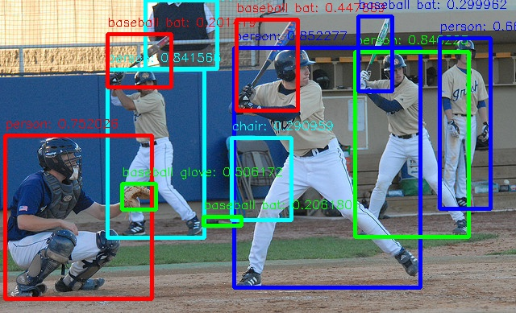

[English](./README.md) | 简体中文

DOSOD 功能包使用说明
=======


# 功能介绍

DOSOD 功能包是基于地瓜机器人自研的开放性词汇检测 [Decoupled Open-Set Object Detector](https://github.com/D-Robotics-AI-Lab/DOSOD) 量化部署的使用示例。图像数据来源于本地图片回灌和订阅到的image msg。此外, DOSOD 支持自定义类别检测, 可在模型导出量化阶段设置自定义类别, 此为DOSOD与常规检测算法最大区别。最终在DOSOD的后处理中发布智能结果, 可通过web查看效果。

# 开发环境

- 编程语言: C/C++
- 开发平台: X5
- 系统版本：Ubuntu 22.04
- 编译工具链: Linux GCC 11.4.0

# 编译

- X5版本：支持在X5 Ubuntu系统上编译和在PC上使用docker交叉编译两种方式。

同时支持通过编译选项控制编译pkg的依赖和pkg的功能。

## 依赖库

- opencv:3.4.5

ros package：

- dnn node
- cv_bridge
- sensor_msgs
- hbm_img_msgs
- ai_msgs

hbm_img_msgs为自定义的图片消息格式, 用于shared mem场景下的图片传输, hbm_img_msgs pkg定义在hobot_msgs中, 因此如果使用shared mem进行图片传输, 需要依赖此pkg。


## 编译选项

1、SHARED_MEM

- shared mem（共享内存传输）使能开关, 默认打开（ON）, 编译时使用-DSHARED_MEM=OFF命令关闭。
- 如果打开, 编译和运行会依赖hbm_img_msgs pkg, 并且需要使用tros进行编译。
- 如果关闭, 编译和运行不依赖hbm_img_msgs pkg, 支持使用原生ros和tros进行编译。
- 对于shared mem通信方式, 当前只支持订阅nv12格式图片。

## X5 Ubuntu系统上编译

1、编译环境确认

- 板端已安装X5 Ubuntu系统。
- 当前编译终端已设置TogetherROS环境变量：`source PATH/setup.bash`。其中PATH为TogetherROS的安装路径。
- 已安装ROS2编译工具colcon。安装的ROS不包含编译工具colcon, 需要手动安装colcon。colcon安装命令：`pip install -U colcon-common-extensions`
- 已编译dnn node package

2、编译

- 编译命令：`colcon build --packages-select hobot_dosod`

## docker交叉编译 X5版本

1、编译环境确认

- 在docker中编译, 并且docker中已经安装好TogetherROS。docker安装、交叉编译说明、TogetherROS编译和部署说明详见机器人开发平台robot_dev_config repo中的README.md。
- 已编译dnn node package
- 已编译hbm_img_msgs package（编译方法见Dependency部分）

2、编译

- 编译命令：

  ```shell
  # RDK X5
  bash robot_dev_config/build.sh -p X5 -s hobot_dosod
  ```

- 编译选项中默认打开了shared mem通信方式。

## 注意事项


# 使用介绍

## 依赖

- mipi_cam package：发布图片msg
- usb_cam package：发布图片msg
- websocket package：渲染图片和ai感知msg

## 参数

| 参数名  | 解释  | 是否必须  | 默认值              | 备注 |
| ------ | ----- | -------- | ------------------- | ---- |
| feed_type          | 图片来源, 0：本地；1：订阅            | 否                   | 0                   |                                                                         |
| image              | 本地图片地址                          | 否                   | config/000000160864.jpg     |                                                                         |
| is_shared_mem_sub  | 使用shared mem通信方式订阅图片        | 否                   | 0                   |                                                                         |
| score_threshold | 模型输出置信度阈值 | 否 | 0.2 | |
| iou_threshold | nms iou阈值 | 否 | 0.5 | |
| nms_top_k | 检测前k个框 | 否 | 50 | |
| dump_render_img    | 是否进行渲染，0：否；1：是            | 否                   | 0                   |   |
| dump_raw_img    | 是否保存原图，0：否；1：是            | 否                   | 0                   |   |
| dump_ai_result    | 是否保存智能结果，0：否；1：是            | 否                   | 0                   |   |
| dump_render_path    | 渲染图片保存路径            | 否                   | .                   |   |
| dump_raw_path    | 原图保存路径            | 否                   | .                   |   |
| dump_ai_result    | 智能结果保存路径            | 否                   | .                   |   |
| ai_msg_pub_topic_name | 发布智能结果的topicname,用于web端展示 | 否                   | /hobot_dosod | |
| ros_img_sub_topic_name | 接收ros图片话题名 | 否                   | /image | |

## 运行

- hobot_dosod 使用到的模型在安装包'config'路径下。

- 编译成功后, 将生成的install路径拷贝到地瓜RDK上（如果是在RDK上编译, 忽略拷贝步骤）, 并执行如下命令运行。

## X5 Ubuntu系统上运行

运行方式1, 使用可执行文件启动：
```shell
export COLCON_CURRENT_PREFIX=./install
source ./install/local_setup.bash
# config中为示例使用的模型, 回灌使用的本地图片
# 根据实际安装路径进行拷贝（docker中的安装路径为install/lib/hobot_dosod/config/, 拷贝命令为cp -r install/lib/hobot_dosod/config/ .）。
cp -r install/hobot_dosod/lib/hobot_dosod/config/ .

# 运行模式1：
# 使用本地jpg格式图片进行回灌预测, 输入自定义类别
ros2 run hobot_dosod hobot_dosod --ros-args -p feed_type:=0 -p image:=config/000000160864.jpg -p image_type:=0 -p dump_render_img:=1

# 运行模式2：
# 使用订阅到的image msg(topic为/image)进行预测, 并设置log级别为warn
ros2 run hobot_dosod hobot_dosod --ros-args -p feed_type:=1 --ros-args --log-level warn

# 运行模式3：使用shared mem通信方式(topic为/hbmem_img)进行预测, 并设置log级别为warn
ros2 run hobot_dosod hobot_dosod --ros-args -p feed_type:=1 -p is_shared_mem_sub:=1 --ros-args --log-level warn
```

运行方式2, 使用launch文件启动：
```shell
export COLCON_CURRENT_PREFIX=./install
source ./install/setup.bash
# config中为示例使用的模型, 根据实际安装路径进行拷贝
# 如果是板端编译（无--merge-install编译选项）, 拷贝命令为cp -r install/PKG_NAME/lib/PKG_NAME/config/ ., 其中PKG_NAME为具体的package名。
cp -r install/lib/hobot_dosod/config/ .

# 配置MIPI摄像头
export CAM_TYPE=mipi

# 启动launch文件, 使用F37 sensor通过shared mem方式发布nv12格式图片
ros2 launch hobot_dosod dosod.launch.py
```

## X5 Buildroot 系统上运行

```shell
export ROS_LOG_DIR=/userdata/
export LD_LIBRARY_PATH=${LD_LIBRARY_PATH}:./install/lib/

# config中为示例使用的模型, 回灌使用的本地图片
cp -r install/lib/hobot_dosod/config/ .

# 运行模式1：
# 使用本地jpg格式图片进行回灌预测, 输入自定义类别
./install/lib/hobot_dosod/hobot_dosod --ros-args -p feed_type:=0 -p image:=config/000000160864.jpg -p image_type:=0 -p dump_render_img:=1

# 运行模式2：
# 使用订阅到的image msg(topic为/image)进行预测, 设置log级别为warn。
./install/lib/hobot_dosod/hobot_dosod --ros-args -p feed_type:=1 --ros-args --log-level warn

# 运行模式3：使用shared mem通信方式(topic为/hbmem_img)通过异步模式进行预测, 并设置log级别为warn
./install/lib/hobot_dosod/hobot_dosod --ros-args -p feed_type:=1 -p is_shared_mem_sub:=1 --ros-args --log-level warn

```

# 结果分析

## X5结果展示

log：

运行命令：`ros2 run hobot_dosod hobot_dosod --ros-args -p feed_type:=0 -p image:=config/000000160864.jpg -p image_type:=0`

```shell
[WARN] [1736235231.771601056] [hobot_dosod]: This is hobot dosod!
[WARN] [1736235231.847169623] [hobot_dosod]: Parameter:
 model_file_name: config/3x-l_epoch_100_rep-coco80-without-nms-int8.bin
 vocabulary_file_name: config/offline_vocabulary.json
 feed_type(0:local, 1:sub): 0
 image: config/000000160864.jpg
 dump_ai_result: 0
 dump_raw_img: 0
 dump_render_img: 1
 dump_ai_path: .
 dump_raw_path: .
 dump_render_path: .
 is_shared_mem_sub: 0
 score_threshold: 0.2
 iou_threshold: 0.5
 nms_top_k: 50
 is_homography: 0
 trigger_mode: 0
 class_mode: 0
 task_num: 2
 roi: 0
 y_offset: 950
 ai_msg_pub_topic_name: /hobot_dosod
 ros_img_sub_topic_name: /image
[INFO] [1736235231.847331832] [dnn]: Node init.
[INFO] [1736235231.847367582] [hobot_dosod]: Set node para.
[WARN] [1736235231.847396749] [hobot_dosod]: model_file_name_: config/3x-l_epoch_100_rep-coco80-without-nms-int8.bin, task_num: 2
[INFO] [1736235231.847449540] [dnn]: Model init.
[BPU_PLAT]BPU Platform Version(1.3.6)!
[HBRT] set log level as 0. version = 3.15.54.0
[DNN] Runtime version = 1.23.10_(3.15.54 HBRT)
[A][DNN][packed_model.cpp:247][Model](2025-01-07,15:33:52.642.13) [HorizonRT] The model builder version = 1.24.3
[W][DNN]bpu_model_info.cpp:491][Version](2025-01-07,15:33:53.18.898) Model: 3x-l_epoch_100_rep-coco80-without-nms. Inconsistency between the hbrt library version 3.15.54.0 and the model build version 3.15.55.0 detected, in order to ensure correct model results, it is recommended to use compilation tools and the BPU SDK from the same OpenExplorer package.
[INFO] [1736235233.030728321] [dnn]: The model input 0 width is 640 and height is 640
[INFO] [1736235233.031005072] [dnn]:
Model Info:
name: 3x-l_epoch_100_rep-coco80-without-nms.
[input]
 - (0) Layout: NCHW, Shape: [1, 3, 640, 640], Type: HB_DNN_IMG_TYPE_NV12.
[output]
 - (0) Layout: NONE, Shape: [1, 1, 8400, 80], Type: HB_DNN_TENSOR_TYPE_S16.
 - (1) Layout: NONE, Shape: [1, 1, 8400, 4], Type: HB_DNN_TENSOR_TYPE_S16.

[INFO] [1736235233.031092322] [dnn]: Task init.
[INFO] [1736235233.033161116] [dnn]: Set task_num [2]
[WARN] [1736235233.033216533] [hobot_dosod]: Get model name: 3x-l_epoch_100_rep-coco80-without-nms from load model.
[INFO] [1736235233.033263366] [hobot_dosod]: The model input width is 640 and height is 640
[WARN] [1736235233.033804451] [hobot_dosod]: Create ai msg publisher with topic_name: /hobot_dosod
[INFO] [1736235233.065223996] [hobot_dosod]: Dnn node feed with local image: config/000000160864.jpg
[INFO] [1736235233.197520685] [hobot_dosod]: Output from frame_id: feedback, stamp: 0.0
[INFO] [1736235233.211616539] [hobot_dosod]: out box size: 12
[INFO] [1736235233.211774456] [hobot_dosod]: det rect: 290.195 59.2845 521.799 357.288, det type: person, score:0.852277
[INFO] [1736235233.211849289] [hobot_dosod]: det rect: 133.109 86.0883 253.594 295.536, det type: person, score:0.841566
[INFO] [1736235233.211914873] [hobot_dosod]: det rect: 440.071 64.9375 581.802 295.919, det type: person, score:0.840223
[INFO] [1736235233.211979748] [hobot_dosod]: det rect: 6.1081 168.679 188.728 372.618, det type: person, score:0.752026
[INFO] [1736235233.212042956] [hobot_dosod]: det rect: 545.25 47.0923 608.295 259.63, det type: person, score:0.660044
[INFO] [1736235233.212107831] [hobot_dosod]: det rect: 180.896 0.0239533 270.768 85.8248, det type: person, score:0.585611
[INFO] [1736235233.212170790] [hobot_dosod]: det rect: 151.529 228.275 194.333 261.067, det type: baseball glove, score:0.506172
[INFO] [1736235233.212235706] [hobot_dosod]: det rect: 293.165 24.1689 370.079 137.492, det type: baseball bat, score:0.447669
[INFO] [1736235233.212297373] [hobot_dosod]: det rect: 444.718 20.4561 486.804 113.706, det type: baseball bat, score:0.299962
[INFO] [1736235233.212363415] [hobot_dosod]: det rect: 287.105 171.218 361.264 273.835, det type: chair, score:0.290959
[INFO] [1736235233.212429457] [hobot_dosod]: det rect: 252.756 269.978 299.8 281.715, det type: baseball bat, score:0.20618
[INFO] [1736235233.212494665] [hobot_dosod]: det rect: 133.085 42.7807 212.73 108.82, det type: baseball bat, score:0.201419
[INFO] [1736235233.214799377] [ImageUtils]: target size: 12
[INFO] [1736235233.214921710] [ImageUtils]: target type: person, rois.size: 1
[INFO] [1736235233.214965502] [ImageUtils]: roi.type: person, x_offset: 290 y_offset: 59 width: 231 height: 298
[INFO] [1736235233.215333669] [ImageUtils]: target type: person, rois.size: 1
[INFO] [1736235233.215380711] [ImageUtils]: roi.type: person, x_offset: 133 y_offset: 86 width: 120 height: 209
[INFO] [1736235233.215592920] [ImageUtils]: target type: person, rois.size: 1
[INFO] [1736235233.215633795] [ImageUtils]: roi.type: person, x_offset: 440 y_offset: 64 width: 141 height: 230
[INFO] [1736235233.215974003] [ImageUtils]: target type: person, rois.size: 1
[INFO] [1736235233.216016545] [ImageUtils]: roi.type: person, x_offset: 6 y_offset: 168 width: 182 height: 203
[INFO] [1736235233.216221962] [ImageUtils]: target type: person, rois.size: 1
[INFO] [1736235233.216261754] [ImageUtils]: roi.type: person, x_offset: 545 y_offset: 47 width: 63 height: 212
[INFO] [1736235233.216453212] [ImageUtils]: target type: person, rois.size: 1
[INFO] [1736235233.216493337] [ImageUtils]: roi.type: person, x_offset: 180 y_offset: 0 width: 89 height: 85
[INFO] [1736235233.216631421] [ImageUtils]: target type: baseball glove, rois.size: 1
[INFO] [1736235233.216670296] [ImageUtils]: roi.type: baseball glove, x_offset: 151 y_offset: 228 width: 42 height: 32
[INFO] [1736235233.216825630] [ImageUtils]: target type: baseball bat, rois.size: 1
[INFO] [1736235233.216864255] [ImageUtils]: roi.type: baseball bat, x_offset: 293 y_offset: 24 width: 76 height: 113
[INFO] [1736235233.217082922] [ImageUtils]: target type: baseball bat, rois.size: 1
[INFO] [1736235233.217123422] [ImageUtils]: roi.type: baseball bat, x_offset: 444 y_offset: 20 width: 42 height: 93
[INFO] [1736235233.217304755] [ImageUtils]: target type: chair, rois.size: 1
[INFO] [1736235233.217342880] [ImageUtils]: roi.type: chair, x_offset: 287 y_offset: 171 width: 74 height: 102
[INFO] [1736235233.217503672] [ImageUtils]: target type: baseball bat, rois.size: 1
[INFO] [1736235233.217542381] [ImageUtils]: roi.type: baseball bat, x_offset: 252 y_offset: 269 width: 47 height: 11
[INFO] [1736235233.217686839] [ImageUtils]: target type: baseball bat, rois.size: 1
[INFO] [1736235233.217725173] [ImageUtils]: roi.type: baseball bat, x_offset: 133 y_offset: 42 width: 79 height: 66
[WARN] [1736235233.217889839] [ImageUtils]: Draw result to file: 0_0_render.jpg
```

## 渲染结果


说明：前处理对图片进行缩放和补全处理。